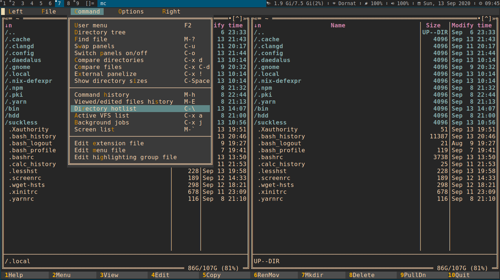

# midnight-commander-gruvbox-skin
Gruvbox skin for GNU Midnight Commander visual file manager.

### Where to put?

Put the file gruvbox256.ini into `~/.local/share/mc/skins/`.

### How to enable?

Open mc and got to `Options` -> `Appearence` and from `Skins` section choose `gruvbox256`.
